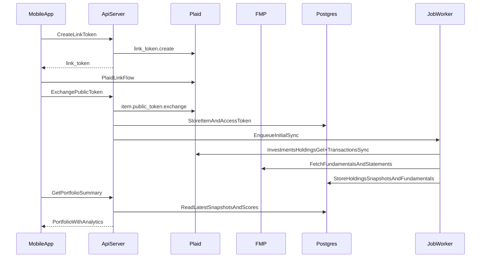

# Quant-Advisor

### Overview
Quant-Advisor is a **mobile iOS app** (React Native + Expo) that connects to your **Robinhood portfolio via Plaid Investments** (read-only in v1) and enriches your portfolio with an **analytics engine** powered by **Financial Modeling Prep (FMP)** to surface key valuation and quantitative signals.

### v1 Scope
- **Hands (Portfolio Integration)**: Plaid Investments connection + holdings/transactions sync (read-only; **no trade execution**).
- **Brain (Analytics Engine)**: fundamentals ingestion (FMP), **P/E**, **baseline DCF**, and a small set of explainable quantitative scores.
- **Developer experience**: run locally on the **iOS Simulator** on your laptop with fast refresh.

### Local Development: iOS Simulator (Expo)
- **Requirements**
  - macOS + **Xcode** (includes **iOS Simulator**)
  - Node.js + package manager (npm/pnpm)
  - Expo tooling (use the project’s local `expo`)
- **Run on Simulator (dev loop)**
  - Start Metro bundler: `expo start`
  - Launch iOS Simulator from the Expo dev server (commonly press `i`)
  - Iterate with **Fast Refresh**
- **Physical device (optional)**
  - Use **Expo Go** for quick device testing
  - If native modules require it, switch to an **Expo Development Build** (still supports simulator + hot reload)

### Architecture
- **Mobile app** (Expo): login, **Plaid Link** connect, portfolio dashboard, position detail, analytics cards, alerts.
- **API backend** (Node.js + TypeScript + Fastify): Plaid Link token endpoints, webhook handlers, portfolio read APIs, analytics endpoints.
- **Data/Jobs**: Postgres for persistence + Redis/BullMQ worker for scheduled sync + analytics recompute.

### Proposed Repo Structure (Monorepo)
- `apps/mobile`: Expo React Native app
- `apps/api`: Fastify API server
- `apps/worker`: BullMQ worker for sync + analytics compute
- `packages/shared`: shared types (e.g., zod schemas) and utilities
- `infra`: docker-compose for Postgres/Redis, env templates

### Data Model (High Level)
- **User**: auth identity (email/OAuth), settings
- **PlaidItem**: item_id, institution_id, status, encrypted access_token
- **Account**: brokerage accounts (taxable/IRA/etc)
- **HoldingSnapshot**: symbol, quantity, cost basis (if available), market value, timestamp
- **Transaction**: buys/sells/dividends/fees where available
- **Fundamentals**: per-symbol cached fundamentals + statements from FMP (timestamped)
- **AnalyticsScore**: per-symbol computed metrics (P/E, intrinsic value, margin of safety, factor scores)

### Plaid Integration (Hands)
- Implement **Plaid Link** connect flow (mobile uses Plaid Link; backend exchanges `public_token` for `access_token`).
- Keep Plaid credentials/tokens **server-side only** (store `access_token` encrypted at rest).
- Sync strategy (initial defaults):
  - **Holdings/transactions**: sync via Plaid investments endpoints + webhooks where available
  - **Prices**: fetch every 30–60 seconds for symbols in portfolio (rate-limit aware)
  - **Fundamentals/statements**: refresh daily/weekly depending on fields
- Add idempotency + dedupe to avoid duplicate snapshots.
- **Fallback** (recommended): manual Robinhood statement/CSV import if linking is temporarily unavailable.

### Analytics Engine (Brain)
- **P/E**: trailing and/or forward P/E based on FMP fields; show **data timestamps** and source.
- **Baseline DCF** (transparent, editable inputs):
  - Use operating cash flow / free cash flow series when available
  - Assumptions: 5–10y projection, terminal growth, discount rate (WACC proxy)
  - Output: intrinsic value per share, implied upside/downside, margin-of-safety bands
- **Quant signals (v1)** (explainable):
  - Value: earnings yield / FCF yield
  - Quality: ROIC proxy, gross margin, debt ratios
  - Momentum (optional): 3m/6m return from price series
  - Aggregate into a single score with sub-scores

### API Endpoints (v1)
- `POST /auth/*`
- `POST /plaid/link-token`
- `POST /plaid/exchange-public-token`
- `POST /plaid/webhook`
- `GET /portfolio/summary`
- `GET /portfolio/positions`
- `GET /symbols/:ticker/analytics`

### Security & Compliance Basics
- Keep SnapTrade + FMP keys **server-side only**.
- Encrypt sensitive tokens at rest; never store secrets in the app.
- Add a clear disclosure: informational only; not financial advice.

### Milestones
- **M1**: Monorepo + infra + auth skeleton + healthchecks + iOS simulator dev loop
- **M2**: Plaid Link connect + initial holdings sync + portfolio screens
- **M3**: FMP ingestion + caching + P/E cards
- **M4**: DCF engine + explainable breakdown + score aggregation
- **M5**: Background scheduling, reliability, and manual import fallback

### Implementation Todos
- `dev-setup-ios-simulator`: Document/setup Expo + Xcode iOS Simulator workflow for local development
- `scaffold-monorepo`: Create monorepo layout, env templates, docker-compose (Postgres/Redis)
- `mobile-app-shell`: Expo app shell (navigation, auth, portfolio screens, typed API client)
- `plaid-link-connect`: Plaid Link token + public token exchange + secure token storage
- `portfolio-sync-jobs`: Worker sync for holdings/transactions + periodic refresh + webhook triggers
- `fmp-ingestion`: FMP client + caching layer + refresh policies + rate limits
- `analytics-pe-dcf`: Compute P/E + baseline DCF + explainable scoring; persist + expose via API
- `portfolio-ui-analytics`: Render analytics cards with timestamps/explainability
- `manual-import-fallback`: Robinhood statement/CSV import -> parse -> store snapshots -> reuse analytics pipeline
- `security-hardening`: Request validation, token encryption, minimal audit logs